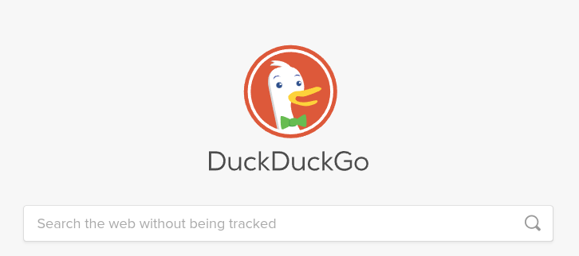

<h1 align="center">
    
</h1>
<h1 align="center">
    
</h1>

## 📋 Sobre

**Teste** foi criado para uma vaga de QA

## 🚀 Tecnologias
- [CSS](https://developer.mozilla.org/pt-BR/docs/Web/CSS)
- [JavaScript](https://developer.mozilla.org/pt-BR/docs/Aprender/JavaScript)
- [Npm](https://www.npmjs.com/)
- [Node](https://nodejs.org/en/)


## 🛠️ Tools
- [Cypress](https://www.cypress.io/)
- [Cucumber](https://cucumber.io/)
- [Visual Studio Code](https://code.visualstudio.com)
- [Docker](https://www.docker.com/)
- [Git](https://git-scm.com/)

## 🔍 Fontes

- [Samuel Agilizei](https://www.youtube.com/watch?v=mfZfhp6Ql8c) - Cucumber
- [Walmyr TaT](https://talkingabouttesting.com/) - Cypress
- [dailypoison](https://www.youtube.com/watch?v=h8wd0V0Yes8&t=538s) - Docker

## 🎮 Como usar
```
1. Clonando o repositório 
$ git clone https://github.com/clestonv/s_dg.git

2. Acessando o diretório do projeto 
$ cd s_dg

3. Instalando as dependências 
$ npm -i --force

4. Executando Modo Headless
$ npx cypress run

OR

5. Executando Com Docker
$ docker run -it -v $PWD:/e2e -w /e2e --entrypoint=cypress cypress/included:3.2.0 run
```


Feito por Cleberson Osorio 🌊
